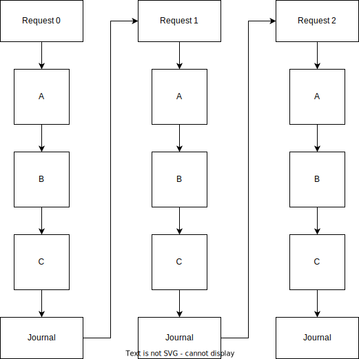
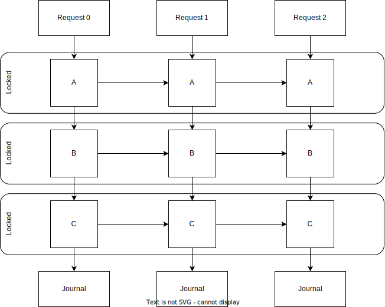

# Flow

## Why journal?

This should be obvious.

## Why use atomic write groups?

If action `fn` performs mutations on subsystems `A`, `B`, and `C`, then if only `A` and `B` successfully persist and `C`'s changes are lost, the device is most likely left in a corrupted irrecoverable state, even if each individual subsystem change is applied atomically.

## Why use locks outside of journal?

If `A`, `B`, and `C` must be done together and atomically, why not just lock the journal for the entire time anyway? This would guarantee thread safety and atomicity across all subsystems without much effort, and also ensure that all reads are only ever done after the data has fully persisted to the device, so there are no data read/write race conditions. For example, if the journal was locked, the operations would look like:

However, this doesn't allow for more efficient code that is safe and possible, such as more relaxed granular locks, atomics, and pipelining. With more granular locks, such as per subsystem, it could look like:

This allows for potentially much better performance, while changes to a subsystem are still recorded in order, and changes within one request are still recorded as one atomic unit. This does require that the logic allows this (no deadlocks, handling any rollbacks, etc.) and is carefully coded; the journal provides no guarantees here. However, there's still one more problem, see the next section.

## Why use ordered journaling?

In the above example, the journal writes themselves are not ordered. Request 0's changes must be persisted before request 1's, and request 1 before request 2, and so on; otherwise, a later request's changes will clobber an earlier one. For example, request 1's change to subsystem A depends on the state after request 0's change, but maybe request 1's final journal atomic write group gets sent for processing earlier than request 0's, even though request 0 finished the change to C earlier, due to unfortunate luck caused by the Tokio scheduler, lock acquisition racing, and other work going on in the system. Therefore, for full safety, we need something like:

Note that this requires more than locking. When a request starts, it acquires a journal sequence number. When an atomic write group is submitted to the journal, it must provide the sequence number. The journal background commit loop will only apply atomic write groups in order; if the next one in the sequence hasn't been submitted yet, it'll go to sleep until the next submit, and then check again.

This shouldn't hamper performance too much, as locks are already required to submit to the journal anyway. This approach requires an additional map, to associate submitted atomic write groups with their sequence number and find the next sequence number from within the commit loop.

## Why use an overlay?

We often want to use on-device data structures that are laid out in a way that allows for accessing and updating them via mmap. This avoids the need to copy and/or recreate those structures in memory, which can be crucial for very large structures, as it would not be efficient (or even feasible) to do so. Using mmap allows leveraging the kernel's native paging functionality that transparently pulls in data when needed and pushes out data when not needed, all while making the data addressable like ordinary memory. However, pages can be written back to the device at any time by the kernel for any reason, and there is no way to prevent this in Linux. This means that, while we can use locks to control access to the data structure for atomicity and integrity, and journaling to control persistence of the data structure to ensure atomicity and integrity, we cannot stop the kernel from flushing a dirty page to the device containing an intermediate data structure state, bypassing the journal completely and leaving the persisted device data in a corrupted state.

For example, consider a red-black tree stored on the device, which we use via mmap. We have a function that inserts an entry into the tree. It acquires a lock to prevent other threads from concurrently mutating the tree, creates an atomic write group, and starts to modify the raw mmapped data and record their changes in the group. So far, everything seems OK: locks prevent race conditions through concurrent mutation, and an atomic write group leverages the journal to ensure the changes persist to the device completely or not at all, never in an intermediate corrupted state. However, consider what happens if the kernel decides to flush the page to the device while the function is rebalancing the tree and performing many changes. The device now contains the tree in an invalid corrupt state. Now if the process crashes, and therefore the write group is never submitted (let alone persisted to) the journal, the corrupted state is now irrecoverable. It's important to handle this scenario for correctness, which is important for any data-handling program. This scenario is not as contrived as it may seem; the rebalancing may take a long time, leaving a big window for the kernel to flush the page. If the kernel starts flushing unprompted, the system may be running out of memory, so the process may start to slow down, freeze, or crash, meaning the journal step that could've fixed the issue by luck is never reached.

Using separate in-memory (i.e. anonymous memory backed) data structures would solve this issue, because mutations don't change the mmap memory. However, if that's impossible, there is no easy solution.

The approach we have taken is to provide an overlay. Think of it like a mmap (write-journal) on top of a mmap (kernel). When a write is requested, its offset and data are copied into an internal data structure. Read requests first check this internal data structure, then read from the underlying mmap. This is essentially how the kernel mmap works: reading from the page cache, then from the underlying device.

The write is tracked as soon as it is added to an atomic write group, not at the final write group submit. It's immediately visible to all other threads, even though it hasn't been submitted to the journal, let alone written to the device. If it wasn't, it'd be impossible to write code around, as it's unknown when the write would actually be readable unless it also knew the exact logic and lifecycle of the write group. It also hasn't been written to the mmap, which remains untouched and in a consistent safe state.

Because this adds some overhead, as an optimisation only *some* writes (and their corresponding reads) should use the overlay. Only use the overlay for writes where there is a requirement to modify some mmap data directly and it cannot submit the change to the journal and wait for it to be committed, most likely because other threads need to work with the new state immediately. Also, all overlay writes must equal an exact size that is configurable. This is because it becomes very difficult to find if the overlay intersects with some range if it contains variable-length ranges. Consider that otherwise ranges may overlap, each with different data; most kernels use fixed-size pages for similar reasons. A common value is 8, commonly used to store pointers and indices in data structures on 64-bit CPUs. We may investigate more flexibility and performance in this area in the future. It's important for the size to be small, as otherwise we duplicate too much memory that already exists in the mmap.

It's safe for only some reads to use the overlay, because generally the logic should know when some data could be on the overlay, because that data is written using the overlay. However, for writes, this causes an issue where some writes may overwrite data in the overlay but not use the overlay itself. This is because logic can shuffle and overwrite data around without the overlay knowing about it, so the overlay data is essentially stale. One way would be to require the user to always remember to evict at all possible points, but this is error prone. Instead, for correctness, we evict the data in the overlay that would be overwritten by the write, but we don't store the write itself in the overlay. This keeps the semantics correct: whenever a write is requested, whether using the overlay or not, it's immediately visible to all other threads and overwrites any existing data that it overlaps with. While not written to the overlay, it is written to the underlying device, which guarantees that writes are immediately visible (for files, guaranteed by POSIX `write`; for mmaps, guaranteed by `MAP_SHARED`), even if not yet flushed or journaled. The overlay is also never stale, because we evict as soon as it's necessary, so reads using the overlay are always safe at any time.

If there is absolute certainty that overlay data will always be correct and there will never be any cache coherency problems, it's possible to disable the cache invalidation requirement for every write. For example, if data at some fixed ranges on the device are *always* read from and written to exactly (i.e. not as part of a bigger or smaller range) and *only* using the overlay, and no other read or write uses the overlay, then it may be safe to turn off cache invalidation.

Concurrency safety (e.g. locks) must continue to be enforced even when using the overlay. However, this should already be in place, as data structures must already use them for concurrency safety anyway. For example, if the pointer field is being updated for a linked list node on the device, writing using the overlay will make the new value readable by other threads, but it doesn't change the fact that two threads could be trying to update the pointer at the same time. Once again though, this will most likely be within an *update* function for the linked list, which will acquire a lock at the beginning of the function, making it safe.

Internally, the overlay is implemented as two tree maps. As writes come in, they are stored in the second map. When the journal begins committing and drains the pending queue, it moves the second map's entries to the first (by doing a fast and simple swap). Once the journal has completed the commit, it will empty the first map. When a read is request, it reads from the second map, then the first map, then the kernel mmap. There are some reasons for this implementation:
- We store entries for the minimum time possible to keep the map small, which results in faster lookups and less memory used. We could use a more complex eviction algorithm, but this keeps it simple and fast.
- The entries at the time of starting a commit can be evicted once the commit ends, but entries added *during* the commit must not be evicted. Therefore, we must use two layers.
- We use a tree map because we need to be able to evict data in the overlay that would be overwritten by writes *not* using the overlay; see previous sections for more details.

The benefit this overlay provides over a similar custom cache map, is that it's integrated with the lifecycle of the journal, so it's correct and efficient.
